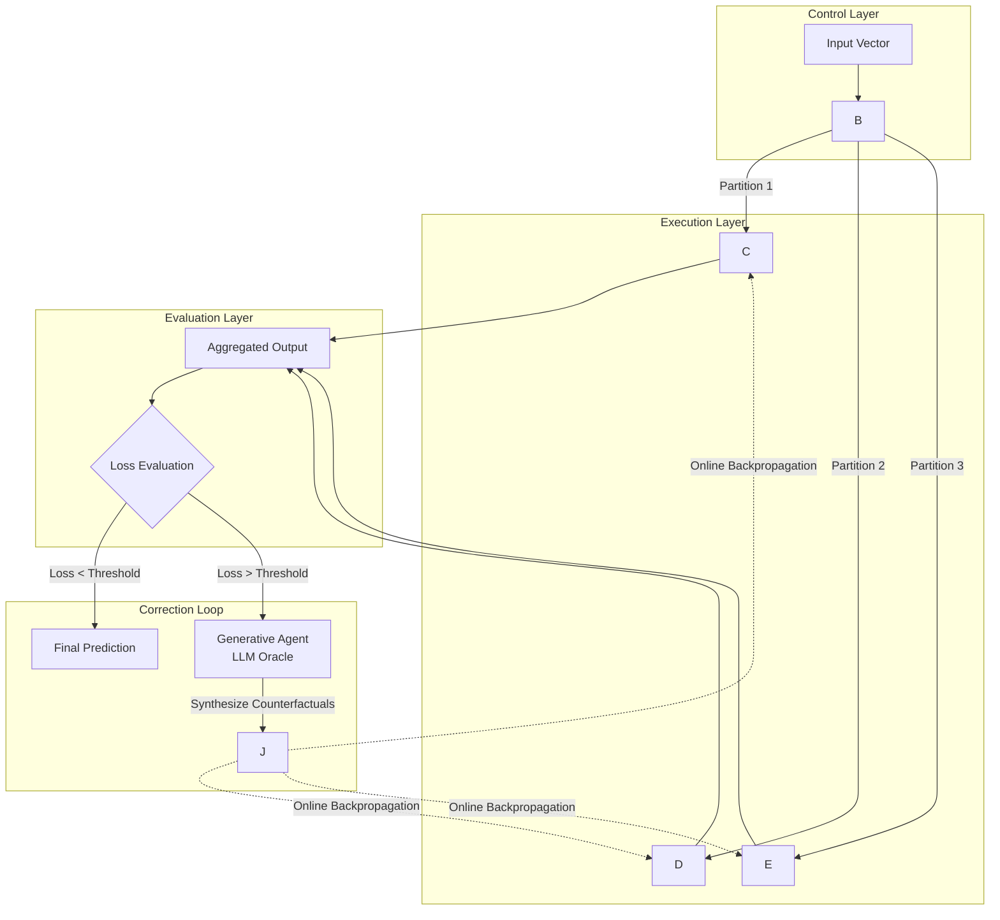

# Neuro-simbolic-hibrid-router

Neuro-Symbolic Semantic Router (NSSR)

Abstract
The Neuro-Symbolic Semantic Router (NSSR) is a reference implementation of a self-correcting hybrid artificial intelligence architecture. This system addresses the trade-off between model interpretability and high-dimensional generalization by integrating a Random Forest-based gating mechanism with a Mixture of Experts (MoE) neural layer. Furthermore, it introduces a Generative Corrective Loop (GCL), leveraging a Large Language Model (LLM) agent to perform online Reinforcement Learning from AI Feedback (RLAIF) via synthetic counterfactual data generation. This repository contains the source code, architectural specifications, and replication scripts necessary to validate the efficacy of dynamic symbolic routing in non-linear domains.
1. System Architecture
The NSSR architecture departs from traditional stochastic gradient descent-based gating by employing a non-differentiable, symbolic router to partition the input space. The system flow is visualized below:

1.1 Core Components
 * Semantic Router: A Random Forest classifier that maps input manifolds to specific neural experts. Unlike softmax gating, this provides transparent decision boundaries based on feature importance.
 * Neural Experts: Independent feed-forward networks specialized for distinct sub-regions of the data distribution.
 * Generative Corrective Loop: An autonomous agent capable of detecting high-entropy predictions and generating synthetic training samples to regularize the active expert, effectively implementing an active learning strategy without human annotation.
2. Installation and Requirements
This implementation relies on PyTorch for the neural components and scikit-learn for the symbolic routing layer.
Prerequisites
 * Python 3.8 or higher
 * CUDA-capable GPU (optional, recommended for larger expert counts)
Setup
# Clone the repository
git clone https://github.com/USERNAME/Neuro-Symbolic-Semantic-Router.git
cd Neuro-Symbolic-Semantic-Router

# Install dependencies
pip install -r requirements.txt

3. Usage and Reproduction
The following example demonstrates the initialization of the hybrid system and the simulation of a training step involving the generative feedback loop.
import numpy as np
from src.main import NeuroSymbolicSystem

# Initialize the system with 20 input features and 3 neural experts
# The 'threshold' parameter defines the sensitivity of the RLAIF trigger
system = NeuroSymbolicSystem(input_dim=20, output_dim=1, n_experts=3)

# Generate dummy data for demonstration
sample_x = np.random.randn(1, 20)
sample_y = np.array([[1.0]])

# Execute a single training step
# The system automatically routes the input and triggers the agent if loss is high
loss, active_expert_index = system.train_step(sample_x, sample_y)

print(f"Training Loss: {loss:.4f}")
print(f"Routed to Expert ID: {active_expert_index}")

To run the full benchmark suite included in the repository:
python -m src.main --mode benchmark --epochs 100

4. Theoretical Background
For a rigorous mathematical formalization of the routing logic and the objective functions used in the Generative Corrective Loop, please refer to the technical whitepaper located at:
[ARCHITECTURE.md](ARCHITECTURE.md)
5. Citation
If you utilize this architecture or code in your research, please cite the following software reference:
@software{nssr_2023,
  author = {Author Name},
  title = {Neuro-Symbolic Semantic Router: A Self-Correcting Hybrid Architecture},
  year = {2023},
  publisher = {GitHub},
  journal = {GitHub repository},
  version = {0.1.0-alpha},
  url = {https://github.com/USERNAME/Neuro-Symbolic-Semantic-Router}
}

6. License
This project is licensed under the GNU General Public License v3.0 (GPLv3).
This license guarantees that the software remains free and open-source. It explicitly includes patent clauses that prevent the monopolization of the underlying methods (e.g., the Random Forest routing mechanism) by ensuring that any modified versions or derivative works must also be distributed under the same GPLv3 terms.
See the [LICENSE](LICENSE) file for the full legal text.
